#### exploratory visualization of the dataset.

Here is an exploratory visualization of the data set.

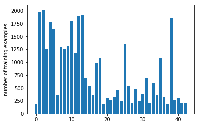

It is a bar chart showing how the data is distributed.
    
In addition, sample images for each type of sign are shown in the notebook. This is the sample images from the first sign class

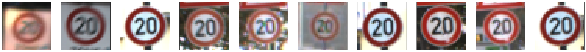

### Design and Test a Model Architecture

#### 1. Preprocessing

For each image, I added a fourth channel which was the canny edges in the color image. Shown are the 3 red, green, and blue (RGB) channels, plus the 4th channel holding the canny edges, followed by the combined rgb image. 

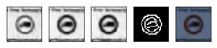

As a last step, I normalized the image data because it was **required**. Actually I found this to be a disadvantage
because it changed the images from byte to float which increased memory usage by a factor 4 knocking
me off the gpu and back on the the cpu slowing my model execution turnarounds.

The training set could have benefitted from augmentation because the traffic signs training set had woefully inadequate data samples.

#### 2. Final model architecture

I followed the **LeNet architecture** in epsiode 11 with modifications:

| Layer         		|     Description	        					| 
|:---------------------:|:---------------------------------------------:| 
| Input         		| 32x32x3 RGB image   							| 
| Convolution 1: 5x5  	| 1x1 stride, VALID padding, outputs 28x28x12 	|
| RELU					|												|
| Normalization			|												|
| Max pooling	      	| 2x2 stride 									|
| Convolution 2: 5x5    | 1x1 stride, VALID padding, outputs 10x10x32	|
| RELU					|												|
| Normalization			|												|
| Max pooling	      	| 2x2 stride,  outputs 10x10x32 				|
| Fully connected 1		| 400 input, 120 output 						|
| Dropout				|												|
| RELU					|												|
| Fully connected 2		| 120 input, 84 output        					|
| Dropout				|												|
| RELU					|												|
| Fully connected 3		| 84 input, 43 output        					|
|						|												|
|						|												|
 

#### 3. Model Training

To train the model, I used an **LeNet architecture** with 10 epochs and a learning rate of 0.001.

I started with:
    * training set accuracy between 79.5% to 86.1%
    * variation was obtained by just (re)shuffling the input data
    * adjusting the number of nodes in each layer had less effect than just the (re)shuffle

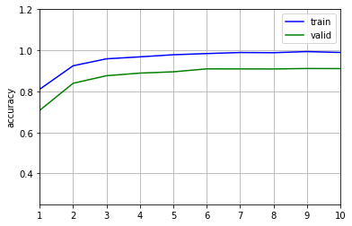
    
I added normalization to the convolution layers based on the paper
[ImageNet Classification with Deep ConvolutionalNeural Networks](http://papers.nips.cc/paper/4824-imagenet-classification-with-deep-convolutional-neural-networks.pdf)
and I got a big boost in accuracy.
    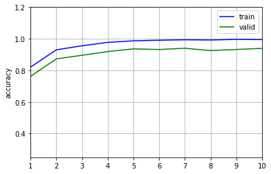

At this point, it looked like the model might be overfitting, so I reduce the width in each layer
and added dropout.
    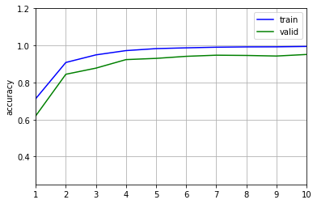

My final model results were:
* training set accuracy of 99.6%
* validation set accuracy of 94.8% 
* test set accuracy of 94.6%

### Test Model on New Images

#### 1. Five German traffic signs found on the web

Here are five German traffic signs that I found on the [web](https://en.wikipedia.org/wiki/Road_signs_in_Germany):

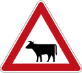
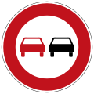

The first and third image will be difficult (to impossible) to classify because they were not in the training set.

#### 2. Model prediction for each of the five new images.

Here are the results of the prediction:

| Image			        |     Prediction	        					| 
|:---------------------:|:---------------------------------------------:| 
| Cattle Crossing  		| Bicycle Crossing (not in training set)		| 
| No Passing 			| No Passing 									|
| One Way To Left		| No Passing (not in training set)				|
| Roadwork	      		| Roadwork						 				|
| Stop					| Stop      									|

The model was able to correctly clasify the 3 traffic signs that were in the training which gives the expected accuracy of 60%.

#### 3. Model prediction for each of the five new images.

The code and charts for the top five predictions on my final model is located almost at the bottom of the Ipython notebook.

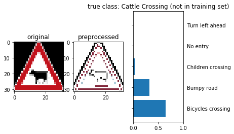

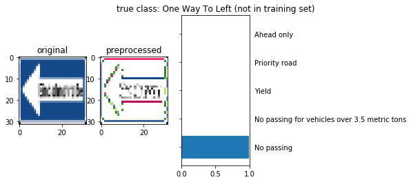
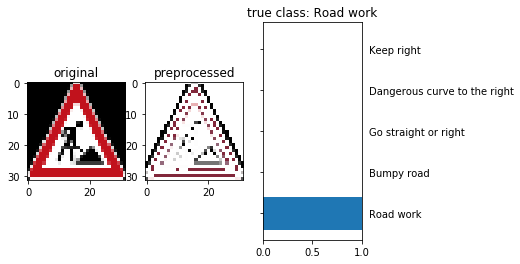

